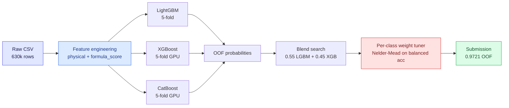
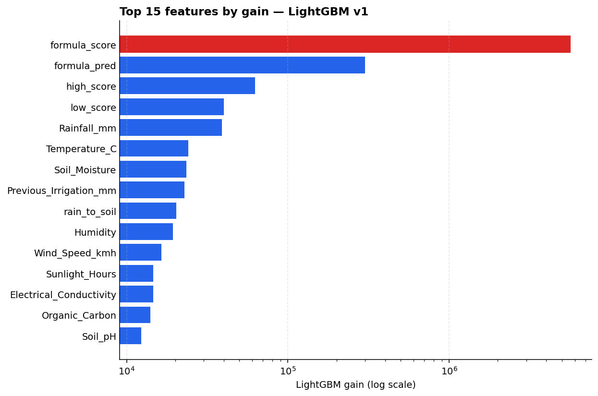

# Predicting Irrigation Need


> **TL;DR** — Reverse-engineered the synthetic label rule into a single `formula_score` feature, tuned per-class probability weights directly against balanced accuracy on a 92/7/1 split, and blended LightGBM + XGBoost to **0.9721 OOF balanced accuracy**.

Kaggle Playground Series — Season 6, Episode 4. Three-class classification (`Low` / `Medium` / `High`) on a synthetic agricultural dataset; the metric is **balanced accuracy** on a heavily imbalanced label distribution (~92% / 7% / 1%).

This repo contains my full solution: feature engineering, three GBM backbones (LightGBM, XGBoost, CatBoost) trained on identical 5-fold splits, a per-class probability-weight tuner that targets balanced accuracy directly, and a decoupled blend search.

## Pipeline



## Results

OOF = balanced accuracy on out-of-fold predictions, after tuning per-class probability weights.

| Model | Features | OOF (argmax) | OOF (tuned) | Public LB | Private LB |
|---|---|---:|---:|----------:|---:|
| LightGBM v0 | base only | 0.9619 | 0.9718 |     _TBD_ | _TBD_ |
| LightGBM v1 | + engineered | 0.9627 | **0.9721** |      1045 | _TBD_ |
| LightGBM v2 | + target encoding | 0.9626 | 0.9720 |     _TBD_ | _TBD_ |
| XGBoost v0  | base only | 0.9622 | 0.9714 |     _TBD_ | _TBD_ |
| CatBoost v0 | base only | 0.9587 | 0.9686 |     _TBD_ | _TBD_ |
| **Blend** (0.55 LGBM + 0.45 XGB) | — | — | 0.9721 |     _TBD_ | _TBD_ |

Final standing: 1045 / 5072 teams.

### What the model learned



The reverse-engineered `formula_score` dominates by an order of magnitude on a log scale — every other feature, including raw `Rainfall_mm` and `Soil_Moisture`, sits at least 100× lower in gain.

## Approach

**1. Feature engineering (`src/features.py`).** Hand-crafted features grouped by physical hypothesis:
- *Heat / evaporative demand* — `et_proxy`, `vpd_proxy`, `heat_wind`, `temp_minus_humid`
- *Water balance* — `rain_per_area`, `rain_to_soil`, `rain_log`, `prev_irr_per_area`
- *Crop-stage × dryness* — `active_growth`, `active_dryness` (only counts dryness when the crop is in an active-water-demand stage)
- *Mulch interactions* — `no_mulch_dryness`
- *Reverse-engineered labeling rule* — bucketed `formula_score = high_score − low_score` from threshold flags on soil moisture, rainfall, temperature, wind, growth stage, and mulching. Inspired by analysis of the synthetic label-generating process; this single feature is consistently the top predictor by gain in every model.

**2. Models (`src/baseline.py`, `src/xgboost_run.py`, `src/catboost_run.py`).** Three GBM backbones share a common 5-fold `StratifiedKFold(seed=42)` split so OOF arrays line up for stacking. LightGBM uses native categorical handling; XGBoost and CatBoost run on GPU.

**3. Target encoding (`src/baseline_te.py`).** In-fold `sklearn.TargetEncoder(target_type="multiclass")` cross-fit inside each training fold to avoid leakage, applied to the original categoricals plus bigram/trigram interactions of the top-3 categoricals.

**4. Threshold tuning (`src/threshold.py`).** Decision rule is `argmax_c P(c|x) · w_c`. Because the metric is balanced accuracy on a 92/7/1 distribution, raw `argmax` collapses to predicting the majority class — class weights are essential. Two-stage optimization: coarse log-grid over `(w_1, w_2)`, then Nelder-Mead refinement. Vectorized `bincount`-based balanced accuracy is ~50× faster than `sklearn.balanced_accuracy_score` on 630k rows, which makes the optimizer practical.

**5. Ensembling (`src/ensemble.py`).** Hand-picked blend ratios over the three models, with class weights re-tuned for each blend. A previous nested optimization (grid + Nelder-Mead inside the blend search) was too slow on 630k rows; the decoupled version runs in ~30 seconds and lands the same optimum.

## Key insights

- **Tuning class weights matters more than picking the model.** The argmax → tuned gap (~+0.010) is several times larger than the gap between the best and worst single model.
- **Reverse-engineering the synthetic label generator was the highest-ROI move.** The `formula_score` feature alone explains why deep trees on raw inputs plateau around 0.972 — the rule is learnable, but only once the right thresholds are exposed as features.
- **CatBoost dragged the blend down** despite being competitive solo. The optimal 3-way blend dropped CatBoost entirely (`no_cb` = 0.55 LGBM + 0.45 XGB), suggesting LGBM and XGB had more diverse error modes.
- **Multiclass target encoding helped less than expected.** TE features ranked top-3 by gain, but they were redundant with the raw `formula_score` — a depth-8 LGBM already learned the rule directly. TE would likely matter more for shallower trees.

<details>
<summary><b>Repository structure</b></summary>

```
src/
  paths.py          # paths, target, class list, feature schemas
  data.py           # load + label-encode train/test (consistent vocab)
  features.py       # engineered numeric features
  threshold.py      # per-class weight tuning for balanced accuracy
  baseline.py       # LightGBM 5-fold runner
  baseline_te.py    # LightGBM + in-fold multiclass target encoding
  xgboost_run.py    # XGBoost 5-fold runner (GPU)
  catboost_run.py   # CatBoost 5-fold runner (GPU)
  ensemble.py       # blend OOF probabilities + re-tune weights
notebooks/
  01_eda.ipynb      # initial exploration
scripts/
  plot_importance.py # render assets/feature_importance.png
data/               # competition data (gitignored)
submissions/        # OOF arrays, test predictions, summaries (gitignored)
assets/             # README images
```

</details>

## Reproducing

Requires Python 3.13 and [uv](https://github.com/astral-sh/uv). Place the competition data at `data/playground-series-s6e4/{train,test,sample_submission}.csv`.

```bash
uv sync                                  # install dependencies
uv run python -m src.baseline            # LightGBM v0
uv run python -m src.baseline_te         # LightGBM with target encoding
uv run python -m src.xgboost_run         # XGBoost (GPU)
uv run python -m src.catboost_run        # CatBoost (GPU)
uv run python -m src.ensemble            # blend search + final submission
```

Each runner writes OOF arrays, test predictions, a summary JSON, and a feature-importance CSV to `submissions/`.

## Stack

LightGBM · XGBoost · CatBoost · scikit-learn · pandas · NumPy · uv
